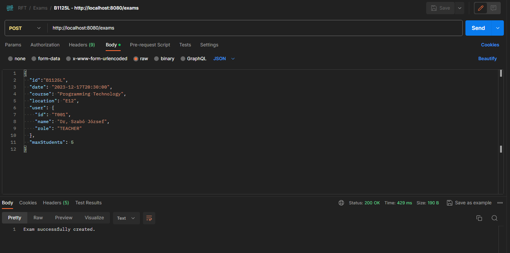
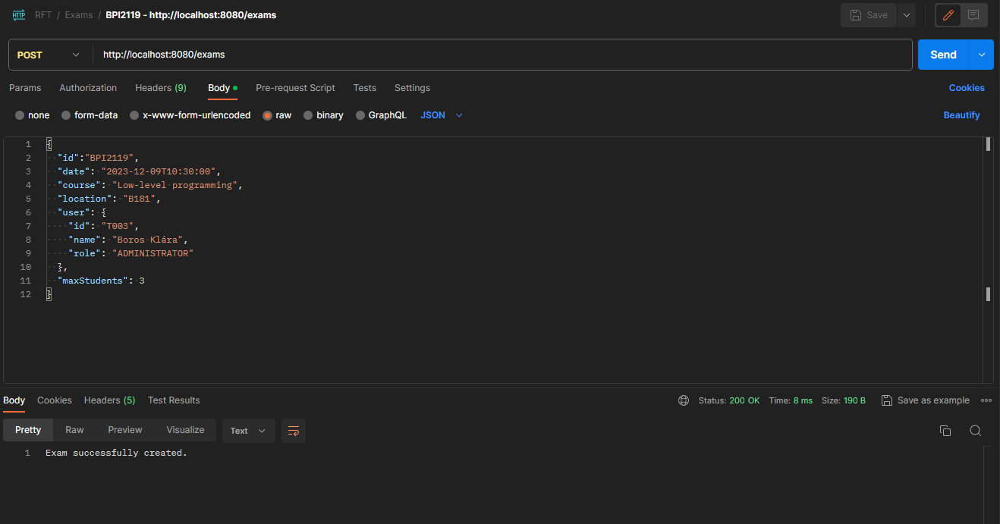
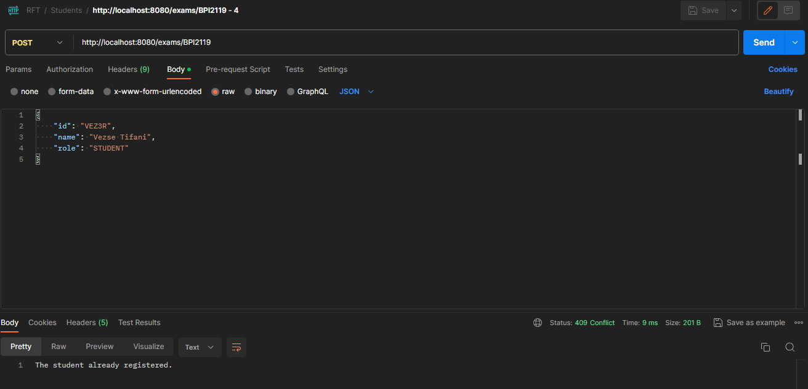

<h1 style="text-align: center"> API teszt POSTMAN által</h1>

A végpontokat felhasználva több esetet is lehet tisztelni, mivel vannak események, amelyek szerepkörhöz kötött.
## A projektben található végpontok:
<table>
    <tr>
        <th>Kérés típusa</th>
        <th>URL</th>
        <th>Rövid leírás</th>
    </tr>
    <tr>
        <td>GET</td>
        <td>/exams</td>
        <td>Kilistázza a rögzített vizsgákat.</td>
    </tr>
    <tr>
        <td>POST</td>
        <td>/exams</td>
        <td>Vizsga rögzítése.</td>
    </tr>
    <tr>
        <td>POST</td>
        <td>/{examId}</td>
        <td>Tanuló regisztrálása a kiválasztott vizsgára.</td>
    </tr>
</table>

## Tesztelt esetek
* Vizsgák lekérdezése
* Vizsga létrehozása tanárként
* Vizsga létrehozása adminisztrátorként
* Vizsgára történő jelentkezés diákként
* Vizsgára történő jelentkezés nem diákként
* Betelt létszámú vizsgára történő jelentkezés diákként

### Vizsgák lekérdezése
A vizsgákat bárki lekérdezheti.

### Vizsga létrehozása tanárként

### Vizsga létrehozása adminisztrátorként

### Vizsgára történő jelentkezés diákként

### Vizsgára történő jelentkezés nem diákként

### Betelt létszámú vizsgára történő jelentkezés diákként

