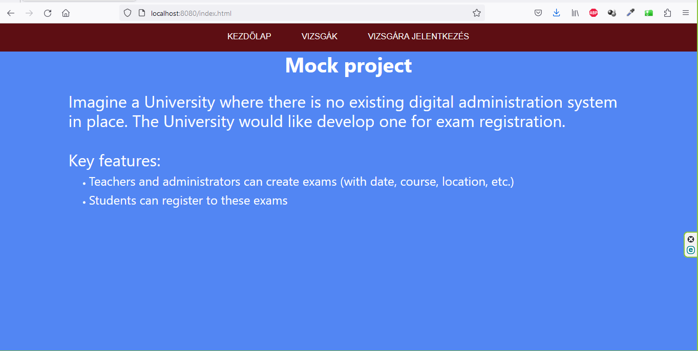

<h1 style="text-align: center">Grafikus felület ismertetése</h1>

Az alkalmazás futattását követően az index.html oldal és egy menüsáv fogad bennünket, amelynek segítségével a különböző felületekre navigálhatunk.

### Kezdőlap (index.html)
A kezdő oldal, ahol egy rövid leírás található az alkalmazásról.

### Vizsgák/Megtekintés (exams.html)
Az oldalon lehetőség van arra, hogy megtekinthessük a már regisztrált vizsgákat és az adott vizsgákra jelentkezett hallgatók névsorát. Több vizsga esetén az olvasás megkönnyítésére vörös sáv emeli ki az egér által mutatott sorban található vizsgát.

### Vizsgák/Létrehozás (createexan.html)
Adminisztrátorként és tanárként lehetőségünk van arra, hogy vizsgákat hozzunk létre. A létrehozáshoz ki kell tölteni a megadott mezőket a legördülő listáról kiválasztani a szerepkörünket és utána a **Küldés** feliratú gombra kattintani.

### Vizsgára jelentkezés (registerstudent.html)
Diákként regisztrálhatunk a legördülő listában megjelenő vizsgák valamelyikére. Miután kitöltöttük a mezőket a jelentkezés gombra kattintást követően megtörténik a regisztráció a kiválasztott vizsgára.

